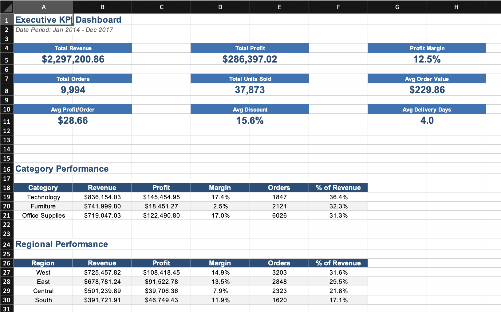
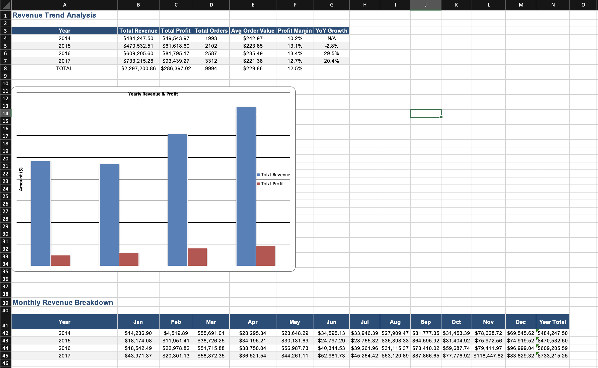
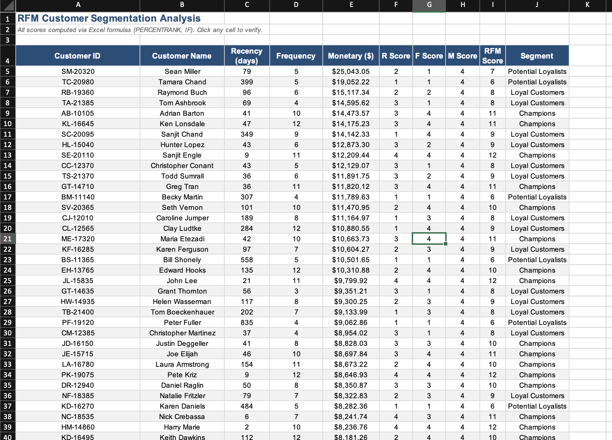

# Sales Analytics — End-to-End Excel Data Analysis Project

A comprehensive Excel-based analytics project analyzing **9,994 sales orders** across the United States (2014–2017). This project demonstrates the full spectrum of analytics techniques used by data analysts — built entirely in Microsoft Excel using **4,400+ formulas** (SUMIF, COUNTIF, AVERAGEIF, PERCENTRANK, PERCENTILE, nested IFs, and more).

---

## Key Findings

| Metric | Value |
|--------|-------|
| Total Revenue | $2,297,201 |
| Total Profit | $286,397 |
| Overall Profit Margin | 12.5% |
| Unique Customers | 793 |
| Unique Products | 1,862 |
| Revenue CAGR (2014–2017) | ~15% |

### Top Insights
- **Pareto Principle confirmed**: ~38% of products generate 80% of revenue (ABC Analysis)
- **Discounts destroy margins**: Orders with >20% discount yield **negative profit margins** — recommended capping at 20%
- **Tables & Bookcases are loss-makers**: Despite healthy sales volume, these sub-categories have negative profitability
- **Champions segment** (top RFM customers) represents just ~16% of customers but drives disproportionate revenue
- **Q4 is peak season**: November and December see 40–60% higher revenue than average months
- **West region leads** in revenue ($725K) while Central has the weakest profit margins

---

## Excel Workbook Overview

The [`Sales_Analysis_Report.xlsx`](Sales_Analysis_Report.xlsx) contains **12 professionally formatted sheets** with **4,400+ dynamic formulas** — every computed value is traceable (click any cell to see the formula in the formula bar).

| # | Sheet | Key Formulas Used | Description |
|---|-------|-------------------|-------------|
| 1 | **Raw Data** | `Delivery Days = Ship Date - Order Date`, `Profit Margin = Profit/Sales` | 9,994 cleaned records with formula-based computed columns |
| 2 | **Summary Statistics** | `AVERAGE`, `MEDIAN`, `STDEV`, `PERCENTILE`, `VAR`, `COUNT` | 14 statistical measures across 5 metrics |
| 3 | **Revenue Analysis** | `SUMPRODUCT`, `LEFT`, `TEXT` for year matching, YoY growth formulas | Yearly & monthly revenue trends with growth rates + charts |
| 4 | **Profitability Analysis** | `SUMIF` across categories/sub-categories, margin calculations | Category & sub-category profit margins + pie/bar charts |
| 5 | **Customer Segmentation** | `PERCENTRANK` + nested `IF` for R/F/M scoring, `COUNTIF`, `SUMIF` | Full RFM analysis on 793 customers — all scores formula-driven |
| 6 | **Product Performance** | Profit margin formulas, cumulative % for ABC classification | Top/bottom products, ABC/Pareto 80-20 analysis |
| 7 | **Regional Analysis** | `SUMIF`, `COUNTIF` on Region/State columns | Region & state-level performance comparison + charts |
| 8 | **Time Series Analysis** | `AVERAGE(B{n-2}:B{n})` for moving averages, MoM growth formulas | 3-month & 6-month moving averages, seasonality index |
| 9 | **Shipping Analysis** | `SUMIF`, `COUNTIF`, `AVERAGEIF` on Ship Mode | Ship mode distribution, delivery time analysis + pie chart |
| 10 | **Discount Impact** | Margin formulas per discount band, category cross-tabulation | Discount bands vs profitability analysis |
| 11 | **KPI Dashboard** | `SUM`, `COUNTA`, `AVERAGE` referencing Raw Data | Executive summary — 9 KPIs + category/region breakdowns |
| 12 | **Cohort Analysis** | Revenue per cohort, avg revenue per customer formulas | Quarterly customer retention & revenue contribution |

---

## Analytics Performed

### 1. Descriptive Statistics
- Mean, median, standard deviation, variance, percentiles, IQR for Sales, Profit, Quantity, Discount, Delivery Days
- Segment-level performance breakdown (Consumer, Corporate, Home Office)

### 2. Revenue Analysis
- Yearly and monthly revenue trends with YoY growth rates
- Monthly revenue breakdown by year with seasonal patterns
- Embedded bar and line charts

### 3. Profitability Analysis
- Profit margins by category, sub-category, region, and segment
- Identification of loss-making sub-categories (Tables, Bookcases)
- Category sales distribution (pie chart)

### 4. Customer Segmentation (RFM Analysis)
- **Recency**: Days since last purchase — scored using `PERCENTRANK` (lower = better = score 4)
- **Frequency**: Number of unique orders — scored using `PERCENTRANK` (higher = better = score 4)
- **Monetary**: Total lifetime spend — scored using `PERCENTRANK` (higher = better = score 4)
- **RFM Score**: `=R+F+M` (formula in every row)
- **Segment**: `=IF(RFM>=10,"Champions",IF(RFM>=8,"Loyal Customers",...))` (formula in every row)
- All 793 customers scored and segmented — fully auditable

### 5. Product Performance & ABC Analysis
- Top 20 revenue-generating products
- Top 10 loss-making products (highlighted in red)
- ABC/Pareto classification: Class A (~38% of products) drives 80% of revenue

### 6. Regional Analysis
- 4-region comparison (West, East, Central, South) with SUMIF/COUNTIF formulas
- Top 15 states ranked by revenue with profit margins

### 7. Time Series Analysis
- 48-month revenue trend with 3-month and 6-month moving averages (AVERAGE formulas)
- Month-over-month growth rate tracking
- Seasonality index (each month's average vs overall average)

### 8. Shipping Analysis
- Ship mode distribution (Standard Class, Second Class, First Class, Same Day)
- Average delivery days per mode using AVERAGEIF
- Delivery time distribution buckets

### 9. Discount Impact Analysis
- 6 discount bands (No Discount through 50%+) with profit margin analysis
- Category x discount cross-tabulation
- Clear pattern: margins turn negative above 20% discount

### 10. Cohort Analysis
- Customers grouped by first-purchase quarter
- Retention rates at Month 0, 3, 6, 9, 12, 18, 24
- Revenue contribution per cohort

---

## Workbook Screenshots

### KPI Dashboard


### Revenue Analysis


### Profitability Analysis


### Customer Segmentation (RFM Scoring)


### Time Series — Moving Averages


### Discount Impact


---

## Project Structure

```
Sales-Analysis-Excel/
├── Sales_Analysis_Report.xlsx   # 12-sheet Excel workbook (4,400+ formulas)
├── data/
│   └── Sales_Orders.csv         # Raw dataset (9,994 records)
├── screenshots/                     # Excel workbook screenshots
│   ├── kpi_dashboard.png
│   ├── revenue_analysis.png
│   ├── profitability_analysis.png
│   ├── customer_segmentation.png
│   ├── time_series.png
│   └── discount_impact.png
├── .gitignore
└── README.md
```

## Tools Used

- **Microsoft Excel** — formulas, formatting, charts, data analysis
- **Excel Functions**: SUMIF, COUNTIF, AVERAGEIF, SUMPRODUCT, PERCENTRANK, PERCENTILE, MEDIAN, STDEV, VAR, nested IF, AVERAGE, SUM, COUNTA, LEFT, TEXT

---

## Dataset

The dataset contains US retail sales order data with the following fields:

| Field | Type | Description |
|-------|------|-------------|
| Order ID | String | Unique order identifier |
| Order Date | Date | Date when order was placed |
| Ship Date | Date | Date when order was shipped |
| Ship Mode | Categorical | Shipping method (Standard, Second Class, First Class, Same Day) |
| Customer ID | String | Unique customer identifier |
| Segment | Categorical | Customer segment (Consumer, Corporate, Home Office) |
| Region | Categorical | Geographic region (West, East, Central, South) |
| Category | Categorical | Product category (Technology, Furniture, Office Supplies) |
| Sub-Category | Categorical | Product sub-category (17 types) |
| Sales | Numeric | Revenue amount |
| Quantity | Numeric | Units ordered |
| Discount | Numeric | Discount applied (0–0.8) |
| Profit | Numeric | Profit/loss amount |

---

## License

This project is open source and available under the [MIT License](LICENSE).
