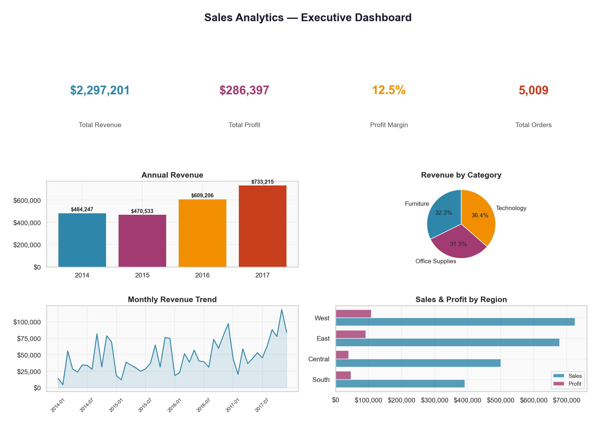
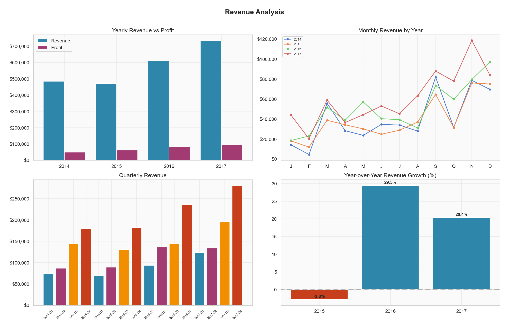
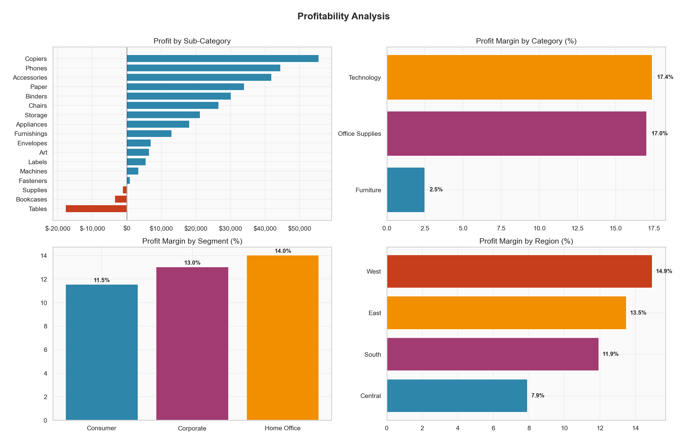
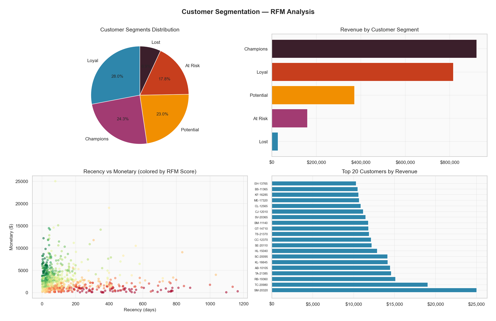
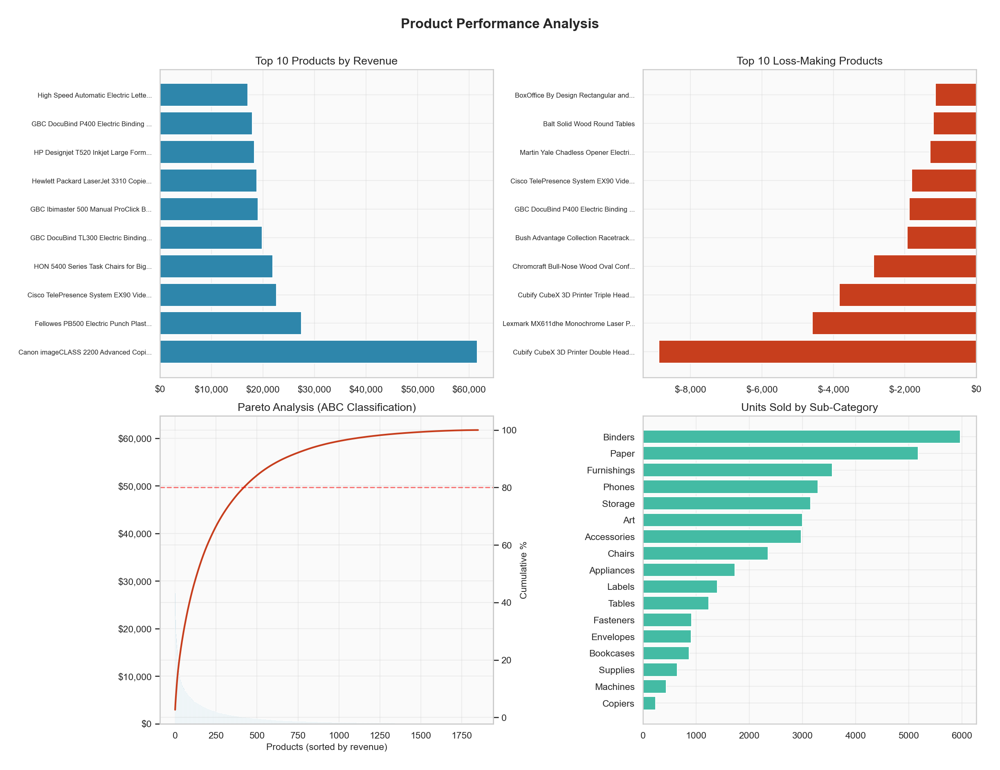
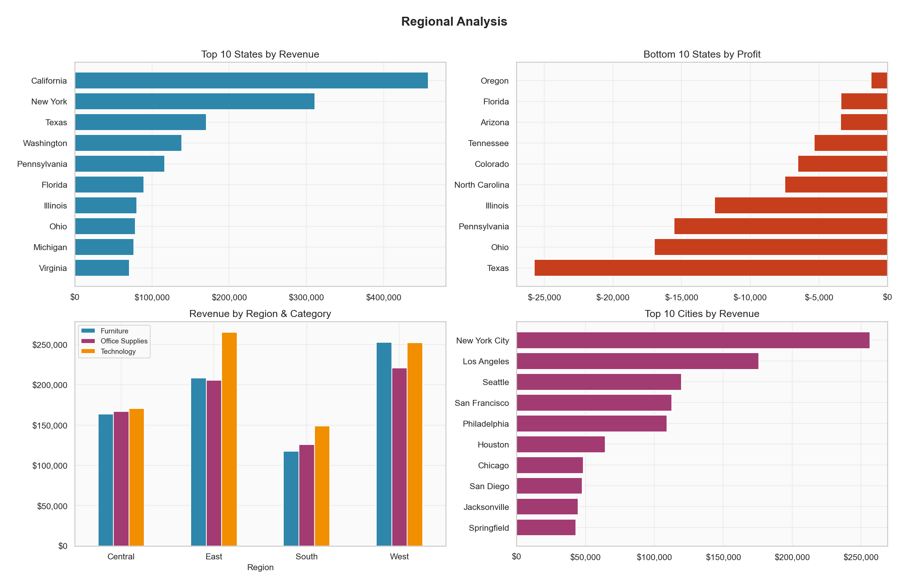
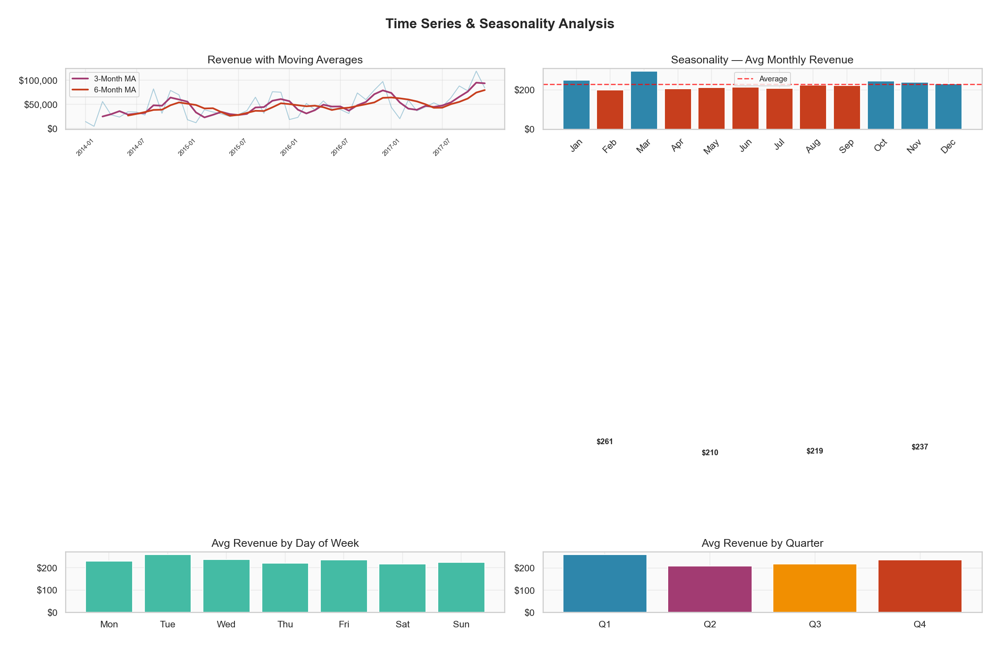
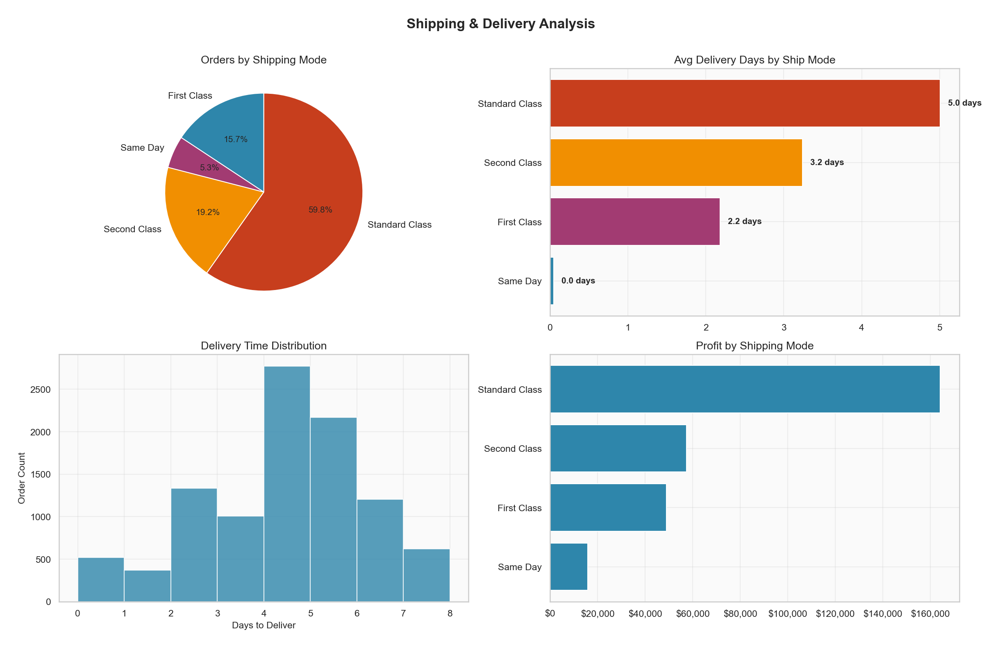
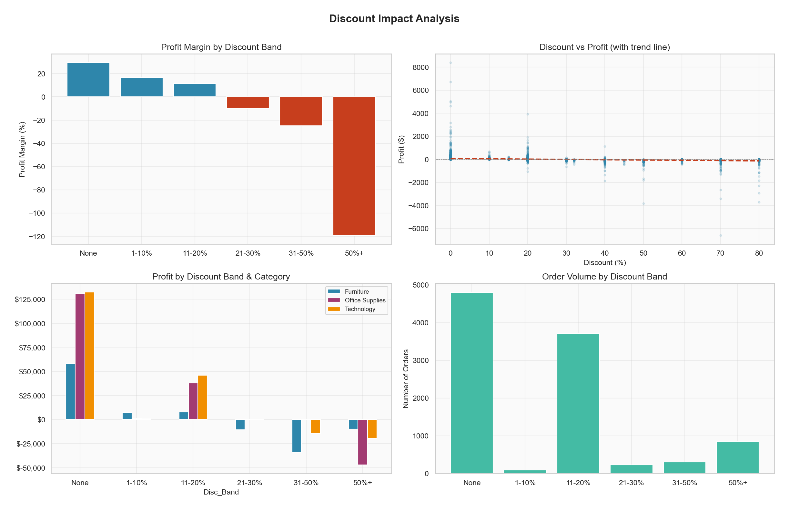
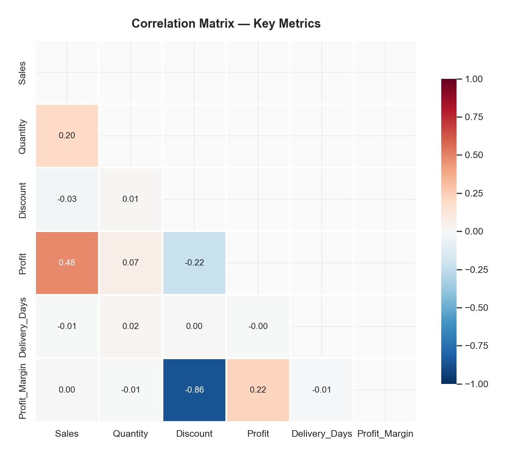

# Sales Analytics — End-to-End Data Analysis Project

A comprehensive data analytics project analyzing **9,994 sales orders** across the United States (2014–2017). This project demonstrates the full spectrum of analytics techniques used by data analysts — from exploratory data analysis and descriptive statistics to customer segmentation, time series analysis, and executive dashboarding.

---

## Key Findings

| Metric | Value |
|--------|-------|
| Total Revenue | $2,297,201 |
| Total Profit | $286,397 |
| Overall Profit Margin | 12.5% |
| Unique Customers | 793 |
| Unique Products | 1,862 |
| Revenue CAGR (2014–2017) | ~15% |

### Top Insights
- **Pareto Principle confirmed**: ~38% of products generate 80% of revenue (ABC Analysis)
- **Discounts destroy margins**: Orders with >20% discount yield **negative profit margins** — recommended capping at 20%
- **Tables & Bookcases are loss-makers**: Despite healthy sales volume, these sub-categories have negative profitability
- **Champions segment** (top RFM customers) represents just ~16% of customers but drives disproportionate revenue
- **Q4 is peak season**: November and December see 40–60% higher revenue than average months
- **West region leads** in revenue ($725K) while Central has the weakest profit margins

---

## Analytics Performed

### 1. Descriptive Statistics
- Mean, median, standard deviation, skewness, kurtosis for all numeric fields
- Distribution analysis across segments

### 2. Revenue Analysis
- Yearly and quarterly revenue trends with YoY growth rates
- Monthly revenue breakdown with seasonality identification
- MoM growth rate tracking

### 3. Profitability Analysis
- Profit margins by category, sub-category, region, and segment
- Identification of loss-making products and sub-categories
- Cross-dimensional profitability comparison

### 4. Customer Segmentation (RFM Analysis)
- **Recency**: Days since last purchase
- **Frequency**: Number of orders
- **Monetary**: Total spend
- Customers classified into: Champions, Loyal, Potential Loyalists, At Risk, Lost
- Customer lifetime value analysis

### 5. Product Performance
- Top/bottom products by revenue and profit
- **ABC/Pareto Analysis**: 80/20 rule classification
- Category and sub-category mix analysis

### 6. Regional Analysis
- Performance comparison across 4 regions (West, East, Central, South)
- State-level revenue and profit ranking
- Top cities by revenue

### 7. Time Series Analysis
- Monthly revenue trend with 3-month and 6-month moving averages
- Seasonality index calculation
- Day-of-week and quarterly patterns

### 8. Shipping Analysis
- Shipping mode distribution and preference analysis
- Delivery time analysis by ship mode
- Shipping impact on profitability

### 9. Discount Impact Analysis
- Discount band analysis with profit margin correlation
- Category-wise discount impact
- Statistical correlation between discount levels and profitability

### 10. Cohort Analysis
- Customer retention by first-purchase quarter
- Revenue contribution by cohort
- Cohort-based customer lifetime value

### 11. Correlation Analysis
- Correlation matrix across Sales, Profit, Quantity, Discount, Delivery Days
- Key relationship identification

---

## Visualizations

### Executive Dashboard


### Revenue Analysis


### Profitability Analysis


### Customer Segmentation (RFM)


### Product Performance & Pareto Analysis


### Regional Analysis


### Time Series & Seasonality


### Shipping Analysis


### Discount Impact


### Correlation Heatmap


---

## Project Structure

```
Sales-Analysis-Excel/
├── data/
│   └── Sales_Orders.csv            # Raw dataset (9,994 records)
├── output/
│   └── Sales_Analysis_Report.xlsx   # 12-sheet Excel analytics workbook
├── scripts/
│   ├── sales_analysis.py           # EDA script (console output)
│   ├── create_workbook.py          # Excel report generator
│   └── generate_visualizations.py  # Chart/visualization generator
├── images/
│   ├── 01_executive_dashboard.png
│   ├── 02_revenue_analysis.png
│   ├── 03_profitability_analysis.png
│   ├── 04_customer_segmentation.png
│   ├── 05_product_performance.png
│   ├── 06_regional_analysis.png
│   ├── 07_time_series_seasonality.png
│   ├── 08_shipping_analysis.png
│   ├── 09_discount_impact.png
│   └── 10_correlation_heatmap.png
├── requirements.txt
├── .gitignore
└── README.md
```

## Excel Workbook Sheets

The `Sales_Analysis_Report.xlsx` contains **12 professionally formatted sheets**:

| # | Sheet | Description |
|---|-------|-------------|
| 1 | Raw Data | Cleaned dataset with calculated fields |
| 2 | Summary Statistics | Descriptive stats (14 measures across 6 metrics) |
| 3 | Revenue Analysis | Yearly/monthly trends with YoY growth + charts |
| 4 | Profitability Analysis | Category/sub-category margins + pie/bar charts |
| 5 | Customer Segmentation | RFM scoring, segment distribution + charts |
| 6 | Product Performance | Top/bottom products, ABC/Pareto analysis |
| 7 | Regional Analysis | Region/state-level performance + charts |
| 8 | Time Series Analysis | Moving averages, seasonality index |
| 9 | Shipping Analysis | Ship mode distribution, delivery time analysis |
| 10 | Discount Impact | Discount bands, category-wise impact |
| 11 | KPI Dashboard | Executive summary with all key metrics |
| 12 | Cohort Analysis | Quarterly customer retention analysis |

---

## Tech Stack

- **Python 3.9+**
- **pandas** — data manipulation and analysis
- **NumPy** — numerical computations
- **openpyxl** — Excel workbook creation with formatting and charts
- **Matplotlib** — publication-quality visualizations
- **Seaborn** — statistical data visualization

## How to Run

```bash
# Clone the repository
git clone https://github.com/yourusername/Sales-Analysis-Excel.git
cd Sales-Analysis-Excel

# Install dependencies
pip install -r requirements.txt

# Run the EDA script
python scripts/sales_analysis.py

# Generate the Excel workbook
python scripts/create_workbook.py

# Generate visualization charts
python scripts/generate_visualizations.py
```

---

## Dataset

The dataset contains US retail sales order data with the following fields:

| Field | Type | Description |
|-------|------|-------------|
| Order ID | String | Unique order identifier |
| Order Date | Date | Date when order was placed |
| Ship Date | Date | Date when order was shipped |
| Ship Mode | Categorical | Shipping method (Standard, Second Class, First Class, Same Day) |
| Customer ID | String | Unique customer identifier |
| Segment | Categorical | Customer segment (Consumer, Corporate, Home Office) |
| Region | Categorical | Geographic region (West, East, Central, South) |
| Category | Categorical | Product category (Technology, Furniture, Office Supplies) |
| Sub-Category | Categorical | Product sub-category (17 types) |
| Sales | Numeric | Revenue amount |
| Quantity | Numeric | Units ordered |
| Discount | Numeric | Discount applied (0–0.8) |
| Profit | Numeric | Profit/loss amount |

---

## License

This project is open source and available under the [MIT License](LICENSE).
